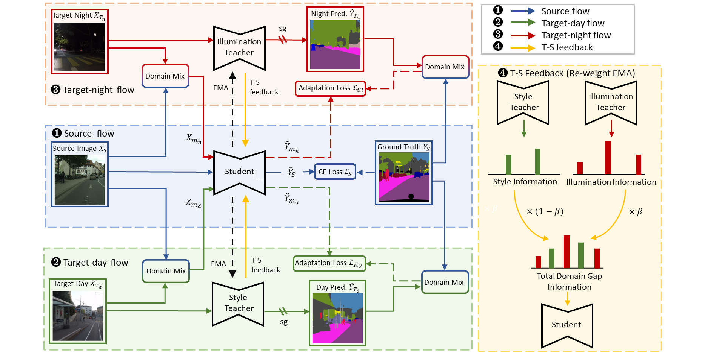
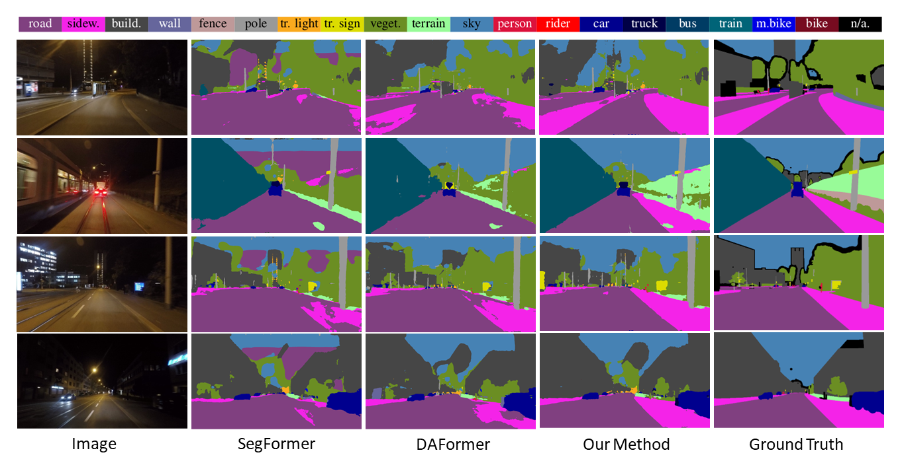
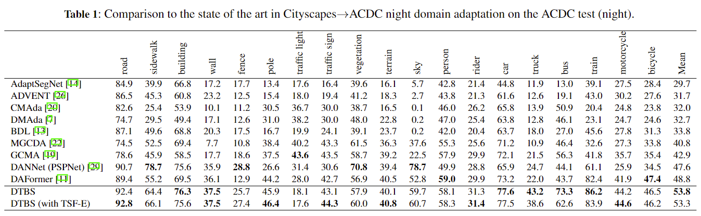

## DTBS: Dual-Teacher Bi-directional Self-training for Domain Adaptation in Nighttime Semantic Segmentation
** by [Fanding Huang], [Zihao Yao], and [Wenhui Zhou]

:bell: **News:**

* [2023-07-15] We are happy to announce that DAFormer was accepted at **ECAI23**.

## Architectute




## Environment

For this project, we used python 3.8.5. We recommend setting up a new virtual
environment:

```shell
python -m venv ~/venv/daformer
source ~/venv/daformer/bin/activate
```

In that environment, the requirements can be installed with:

```shell
pip install -r requirements.txt -f https://download.pytorch.org/whl/torch_stable.html
pip install mmcv-full==1.3.7  # requires the other packages to be installed first
```

All experiments were executed on a NVIDIA RTX 3090 Ti.

## Datasets

**Cityscapes:** Please, download leftImg8bit_trainvaltest.zip and
gt_trainvaltest.zip from [here](https://www.cityscapes-dataset.com/downloads/)
and extract them to `data/cityscapes`.

**ACDC:** Please, download rgb_anon_trainvaltest.zip and
gt_trainval.zip from [here](https://acdc.vision.ee.ethz.ch/download) and
extract them to `data/acdc`. 

**Dark Zurich :** Please, download the Dark_Zurich_train_anon.zip
and Dark_Zurich_val_anon.zip from
[here](https://www.trace.ethz.ch/publications/2019/GCMA_UIoU/) and extract it
to `data/dark_zurich`.

**Data Preprocessing:** Finally, please run the following scripts to convert the label IDs to the
train IDs and to generate the class index for RCS:

```shell
python tools/convert_datasets/cityscapes.py data/cityscapes --nproc 8
```

## Demo

Already as this point, the provided DTBS model can be applied to a demo image:

```shell
python -m demo.image_demo demo/demo.png work_dirs/211108_1622_gta2cs_daformer_s0_7f24c/211108_1622_gta2cs_daformer_s0_7f24c.json work_dirs/211108_1622_gta2cs_daformer_s0_7f24c/latest.pth
```

When judging the predictions, please keep in mind that DTBS had no access
to real-world labels during the training.

## Training

A training job of Cityscapes to ACDC night can be launched using:

```shell
python run_experiments.py --config configs/DTBS/gta2cs_uda_warm_fdthings_rcs_croppl_a999_DTBS.py
```

More experiments in our paper (e.g. network architecture comparison,
component ablations, ...) are coming soon

## Checkpoints

Below, we provide checkpoints of DTBS for different benchmarks.

* [DTBS for Cityscapes→ACDC](https://drive.google.com/file/d/1pi9sZmpUs8Nz5-nVu0Mt-itZkSj2xfa7/view?usp=sharing)
* [DTBS for Cityscapes→DarkZurich](https://drive.google.com/file/d/1pi9sZmpUs8Nz5-nVu0Mt-itZkSj2xfa7/view?usp=sharing)


## Results on CS->acdc night





